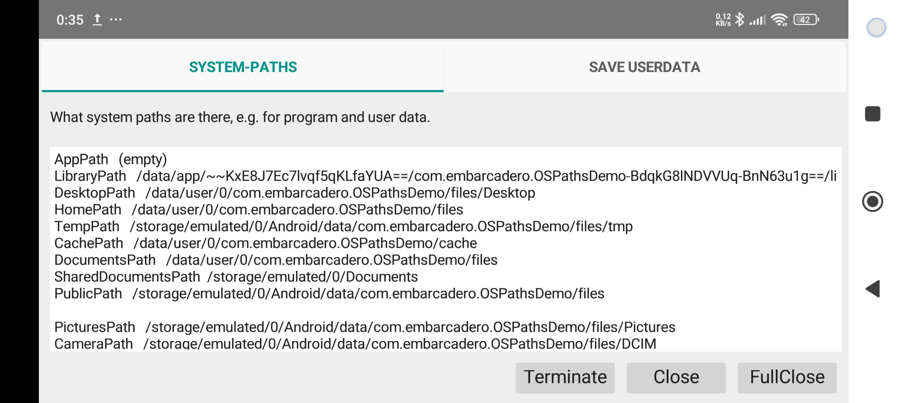

# pre-compiled Download

[OSPathsDemo.exe](https://geheimniswelten.de/GitHub/OSPathsDemo.exe) (11 MB)  
[OSPathsDemo.apk](https://geheimniswelten.de/GitHub/OSPathsDemo.apk) (10 MB)

# OSPathsDemo

Small demo and test application to see in which system paths program and user data can be stored.

 

